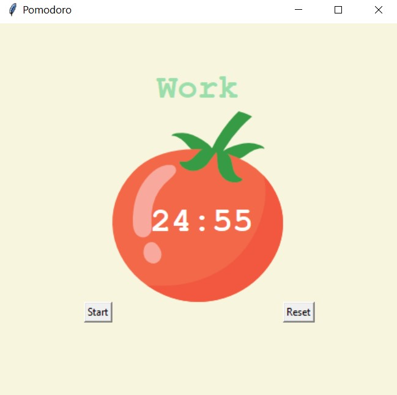
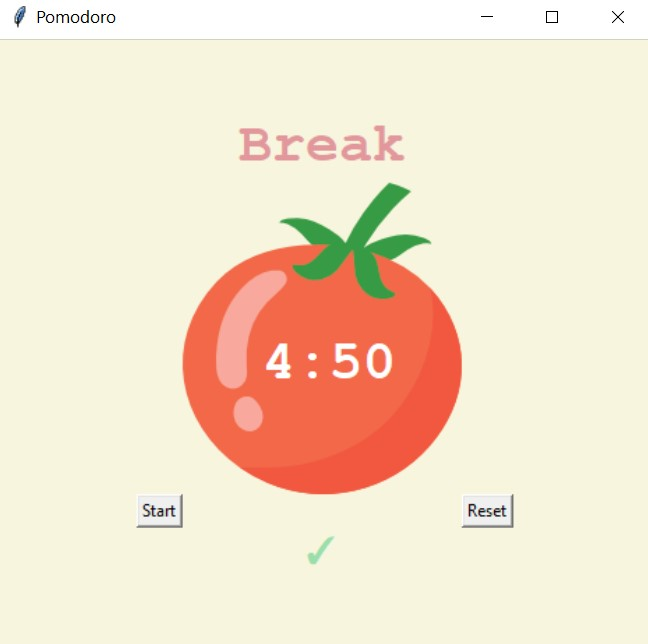

# Pomodoro App
---
This is a project that was created as a consolidation of the material from an online Python course. This is an attempt to create Pomodoro app using Tkinter. The Pomodoro Technique is a time management method developed by Francesco Cirillo. It uses a timer to break work into intervals, in this case 25 minutes long, separated by short five minutes breaks.

## Technologies
---
Project is created with: 
+ Pyhon 3.10

## How to run the project:
---
```
git clone https://github.com/Karolina-D-97/Pomodoro.git
main.py
```
## How to use the app:
---
+ run the app
+ decide on the task to be done
+ click start button and work on the task for 25 minutes
+ after 25 minutes, the app will show you that you can take a 5 minute break
+ after four pomodoro are done, the app will show you that you can take a 25 minute break

---

---

